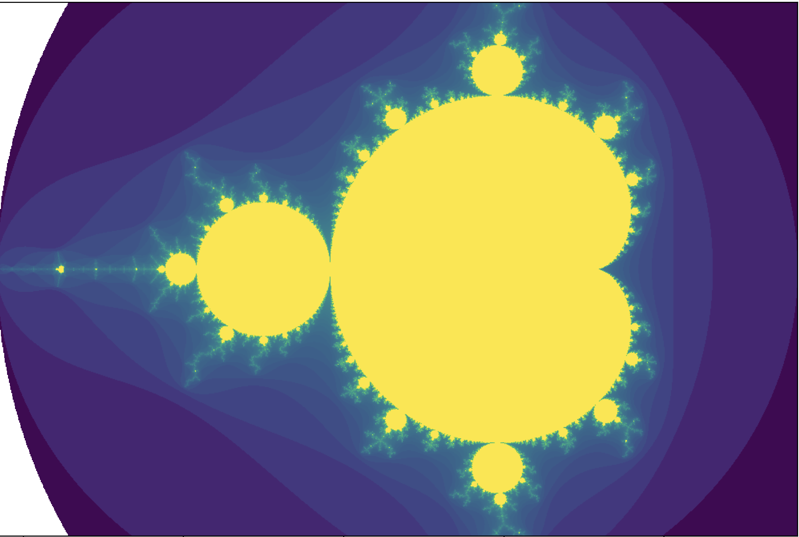
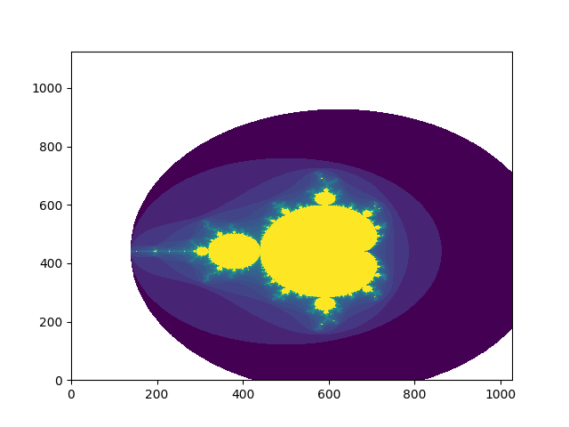

# fractals
C code to generate gifs of the classic Mandelbrot set zoom.

To run C script just use make
```Bash
make
```

Example output: still image


Example output: gif (can be much higher zoom/resolution, this was rendered on my home laptop)

